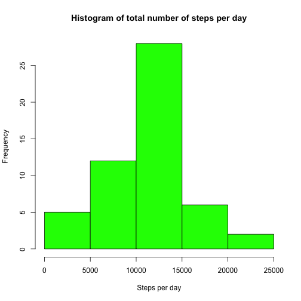
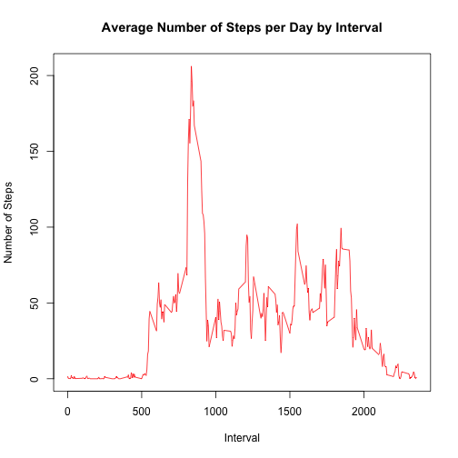
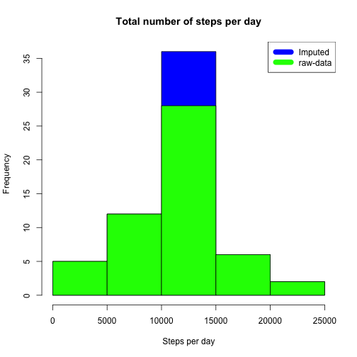
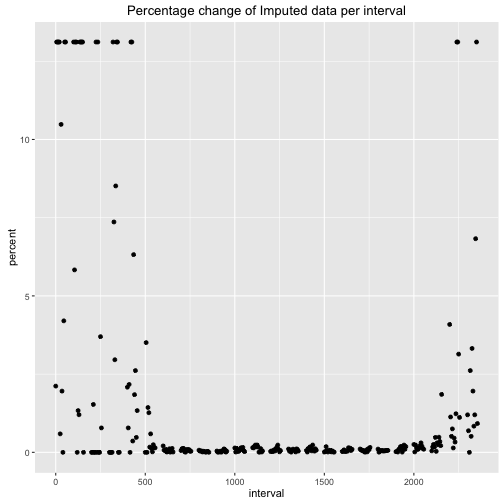
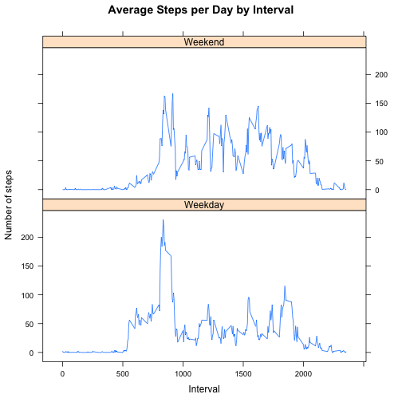

Reproducible Research 1
=======================

Human Activity Recognition Using Smartphones Data Set 

Author: Thomas Berger (https://github.com/bergertom/ReproducibleResearch1.git)

This analysis was generated on 2016-02-03 16:36:48 by running the script ``run_PA1_template.R``.

1. Load and preprocess the data
-------------------------------

```r
# read the data
raw_data <- data.frame(read.csv(datafile))

# For this part of the assignment, you can ignore the missing values in the dataset.
clean_data <- na.omit(raw_data)
```

2. Calculate the total number of steps per day
----------------------------------------------


```r
# Calculate the total number of steps taken per day
steps_per_day <- aggregate(clean_data[,"steps"], by=list(clean_data$date), "sum")
colnames(steps_per_day) <- c("date","steps")

# Make a histogram of the total number of steps taken each day
hist(steps_per_day$steps, main = "Histogram of total number of steps per day", xlab = "Steps per day", col="green")
```

 
 
3. Calculate and the mean and median number of steps taken
----------------------------------------------------------

Calculate and report the mean and median of the total number of steps taken per day


```r
# calculate mean steps per day
round(mean(steps_per_day$steps))
```

```
## [1] 10766
```

```r
# calculate median steps per day
median(steps_per_day$steps)
```

```
## [1] 10765
```

The mean number steps are 10766 and 
the median 10765 of the total number of steps taken per day.

4. Make a time series plot of the interval, across all days
-----------------------------------------------------------

Make a time series plot of the interval, using average number of steps taken, across all days


```r
# aggregate average number of steps by interval
steps_by_interval <- aggregate(steps ~ interval, clean_data, mean)

# Make a time series plot (i.e. 𝚝𝚢𝚙𝚎 = "𝚕") of the 5-minute interval (x-axis)
# and the average number of steps taken, averaged across all days (y-axis)
plot(steps_by_interval$interval,steps_by_interval$steps, type="l", xlab="Interval", 
   ylab="Number of Steps",main="Average Number of Steps per Day by Interval", col="red")
```

 

Which 5-minute interval, on average across all the days in the dataset, contains the maximum number of steps?

```r
# calculate the max steps per interval
steps_by_interval[which.max(steps_by_interval$steps),"interval"]
```

```
## [1] 835
```
The 5-minute interval containing the maximum number of steps, 
on average across all the days in the data set, is 835.

5. Imputing missing values
--------------------------

Calculate and report the total number of missing values in the dataset

```r
# the total number of rows with NA values
sum(is.na(raw_data))
```

```
## [1] 2304
```
The dataset contains 2304 rows with NA values.

Only a simple imputation was required for this assignment. 
The strategy chosen was to use the mean for that 5-minute interval to replace NA values.

```r
# get days which contain NA values
missing_days <- unique(raw_data[is.na(raw_data$steps),"date"])

# create a new data frame
imputed_data <- data.frame(raw_data)

# calculate mean steps for each interval
mean_steps <- aggregate(clean_data$steps,by=list(clean_data$interval), mean)

# loop through NA values for all missing days
for (dt in missing_days) {
    # loop through the intervals for that day
    for (int in imputed_data[imputed_data$date == dt,"interval"]) {
        # substitute the NA step value with the mean number of steps for that day and interval
        imputed_data[imputed_data$date == dt & imputed_data$interval == int, "steps"] <- round(mean_steps[mean_steps[1] == int,2])
    }
}
```

For example the 5-minute number 2355 mean value is 1.0754717 
which is rounded to 1 

6. Compare imputed data with raw data
-------------------------------------


```r
# Calculate the total number of steps taken per day for imputed data
steps_per_day_imp <- aggregate(imputed_data[,"steps"], by=list(imputed_data$date), "sum")
colnames(steps_per_day_imp) <- c("date","steps")

# plot the imputed data (first, because it has more dates)
hist(steps_per_day_imp$steps, main = "Total number of steps per day", xlab = "Steps per day", col="blue")
# plot clean=raw data
hist(steps_per_day$steps, main = "Total number of steps per day", xlab = "Steps per day", col="green", add=T)
# add the legend
legend("topright", c("Imputed", "raw-data"), col=c("blue", "green"), lwd=10)
```

 

6. Compare mean and median steps using imputed data
---------------------------------------------------

Make a histogram of the total number of steps taken each day and calculate and report the
mean and median total number of steps taken per day. Do these values differ from the estimates
from the first part of the assignment? 

What is the impact of imputing missing data on the estimates of the total daily number of steps?

```r
# aggregate average number of steps by interval
steps_by_interval <- aggregate(steps ~ interval, clean_data, mean)
steps_by_interval_imp <- aggregate(steps ~ interval, imputed_data, mean)

# compute the difference between clean and imputed data
steps_by_interval_diff <- data.frame (interval = steps_by_interval$interval,
     steps_clean   = steps_by_interval$steps,
     steps_imputed = steps_by_interval_imp$steps,
     steps_delta = abs(steps_by_interval_imp$steps - steps_by_interval$steps))
# calculate the max steps
steps_by_interval_diff$steps_max <- apply(steps_by_interval_diff[,c("steps_clean","steps_imputed")],1,max)
# calculate the percentage
steps_by_interval_diff <- transform(steps_by_interval_diff, percent = (steps_delta / steps_max) * 100)
# if steps are zero, percentage is NaN; set percentage zero
steps_by_interval_diff[steps_by_interval_diff$steps_clean == 0, "percent"] <- 0

# maximal difference between imputed mean steps
max(steps_by_interval_diff$steps_delta)
```

```
## [1] 0.06433653
```

```r
# plot the difference by steps per day by interval
qplot(interval, percent, data=steps_by_interval_diff, main="Percentage change of Imputed data per interval")
```

 

The imputed steps differs with a maximum variance of 0.0643365 from the the original data.
The max difference is 13.1147541 percent.
When we look at the chart, the difference of 13% is in the interval between (0-500) and after 2000.

The impact of imputing missing data on the estimates of the total daily number needs to be considered when the number of steps is small (below 10), as such the difference on the plot of average number of steps per day is not visible.

7. Analyze weekdays and weekends
--------------------------------

Are there differences in activity patterns between weekdays and weekends?

```r
# set all days to weekdays
imputed_data$week <- as.factor("Weekday")

# add a factor for the weekend
levels(imputed_data$week) <- c(levels(imputed_data$week), "Weekend")
# set the weekend days
imputed_data[weekdays(as.Date(imputed_data$date)) == "Saturday" | weekdays(as.Date(imputed_data$date)) == "Sunday","week"] <- "Weekend"
# aggregate average number of steps by interval
steps_by_interval_week <- aggregate(steps ~ interval + week, imputed_data, mean)

# create the plot weekend vs weekdays
library(lattice)
xyplot(steps_by_interval_week$steps ~ steps_by_interval_week$interval|steps_by_interval_week$week, 
       main="Average Steps per Day by Interval",xlab="Interval", ylab="Number of steps",layout=c(1,2), type="l")
```

 

The plot to compares the number of steps during the week and weekend.
On the weekdays there is a higher peak earlier, but there is more overall activity on weekends.
